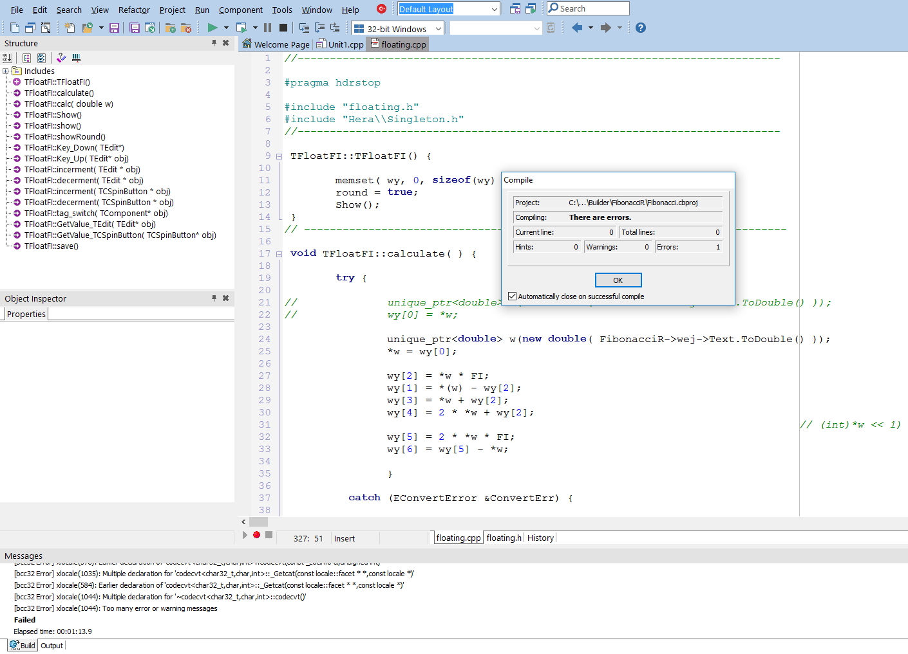

# <a href="https://github.com/informacja/FibonacciR/releases"> FibonacciR </a>
Narzędzie dla projektantów, wykorzystuje złotą proporcję

## Demo

## Builder 

## Arrows arranged by Fibonacci Golden Ratio

<a href="../../releases"> <h1> Download Application </h1> </a>

